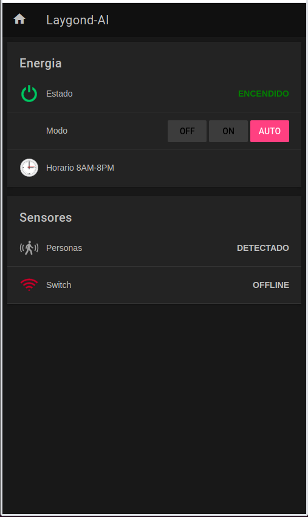

# Elevator-AI
Intelligent Elevator for a Residential Building using OpenHAB, OpenCV, and TensorFlow for creating Automation Rules

# Web/Mobile App Sitemap
<p align="center">  </p>
<p align="center"> Fig1: Elevator currently ON and set to work automatically. There are currently people inside and switch is currently out of range of elevator cabin. </p>

# Implemented Features So Far ...
- Turn elevator ON/OFF based on a schedule or manually from a Web/Mobile app sitemap
- Enable and give access to an elevator button panel based on NFC tags: cards & phones
- Control of list of allowed NFC tags per floor/office from the Web/Mobile app sitemap
- More later ...

# Directory Structure
```
.Elevator-AI
├── README.md
├── README_images            # Images used by README.md
│   └── ...
├── firmware                 # Custom ESP8266/32 IoT firmware
│   ├── custom-motion-sensor # detects motion inside elevator
│   ├── custom-servo-switch  # turns elevator ON/OFF
│   └── custom-led-strip     # turns green or red based nfc tag
├── openhab2                 # soft link to openhab's directory
│   ├── items
│   ├── rules
│   ├── sitemaps
│   ├── things
│   └── ...
├── nfc_reader
│   ├── database.csv         # all UIID from nfc tags
│   ├── groupData.csv        # tags associated by groups
│   ├── activate_panda.py    # panda version of activate.py
│   ├── activate.py          # sets tags as active (changes groupData.csv)
│   ├── nfc-launch.service   # run in bg check_tag.py softlink to systemd
│   ├── check_tag.py         # verifies if tag is considered active
│   ├── read_card_fully.py   # util tool 
│   ├── read_write_add2DB.py # util tool
│   └── show_active_switches.py  # initializes openhab switches on startup 
├── no_signal.png
└── simple_cam_monitor.py
```

## General Overview
#### NFC Reader
When openhab initializes, it uses the info in `groupData.csv` to update the nfc toggle switches (Fig1) through `show_active_switches.py`. After that any change on the toggle switches triggers `activate.py` which in turn modifies/updates `groupData.csv`. On startup, in parallel to openhab, `check_tag.py` launches in the background and runs indefintely thanks to `nfc-launch.service` instructions to systemd. `check_tag.py` uses `groupData.csv` which contains the list of active and non-active nfc tags (associated by floor-n-offices) to enable or not the elevator's button panel. To enable the button pannel `check_tag.py` sends messages to a relay connected directly to the pi via GPIO and MQTT messages to the ESP8266 LED Strip to turn on green or red as a visual notification.
#### Power Schedule
This part is entirely run by openhab rules. Since there is not enough Wi-Fi range throughout the whole building, the elevator is set at 8 PM to "press the lobby button" through a set of relays connected to the pi. This action tries continously to take place as long as the motion sensor indicates no people inside the elevator cabin. Once at the lobby with no people the connectivity range to the servo switch and current sensor located at the lobby's power room are verified. It is the connectivity range itself the indicator that the elevator has reached the lobby. The elevator is then shut down through the servo switch. At 8 AM the current sensor is used to verify the elevator has not been turned on yet and proceeds to use the servo switch to turn it on. The app's manual control features can only be operated if the elevator cabin is within range to the lobby's power room.
#### Soft Links
- Openhab's directory: `/etc/openhab2` soft linked to `/home/openhabian/Elevator-AI/openhab2/`
- nfc-launch.service : `/etc/systemd/system/nfc-launch.service` soft linked to `/home/openhabian/Elevator-AI/nfc_reader/nfc-launch.service`

# Hardware
- Router (inside elevator)
- Raspberry Pi 4 8Gb (inside elevator)
- USB NFC Card Reader (connected to pi and inside elevator)
- Relay (connected to pi and inside elevator)
- ESP8266 Motion Sensor (inside elevator)
- ESP8266 LED Strip (inside elevator)
- ESP8266 Servo Switch (at lobby power room)
- ESP8266 Current Sensor (at lobby power room)

# Installation
### In your router
Reserve IP adresses for rpi4 and ESP8266/32 IoT devices
### In your rpi4
After installing openhab then from terminal at home directory: `cd ~`
```
git clone https://github.com/laygond/Elevator-AI.git
rm -rf /etc/openhab2
cd /etc && ln -s /home/openhabian/Elevator-AI/openhab2/
cd /etc/systemd/system/ && ln -s /home/openhabian/Elevator-AI/nfc_reader/nfc-launch.service
```
### In your ESP8266/32 IoTs
All code must be uploaded to their respective ESP8266/32. The code for each IoT is located in the firmware folder (see Directory Structure)


# References
### Load Code to IoT Devices
- [Install Arduino in Linux](https://www.arduino.cc/en/guide/linux)
- [Add ESP8266 to Arduino Board Manager](https://randomnerdtutorials.com/how-to-install-esp8266-board-arduino-ide/)
- [Discussion of QIO DIO QOUT DOUT flash modes](https://www.esp32.com/viewtopic.php?t=1250)
- [Flash Firmware to Tuya Devices Over the Air](https://www.youtube.com/watch?v=O5GYh470m5k&ab_channel=digiblurDIY)
- [Figuring out generic tuya devices control pins](https://www.youtube.com/watch?v=m_O24tTzv8g&ab_channel=digiblurDIY)
